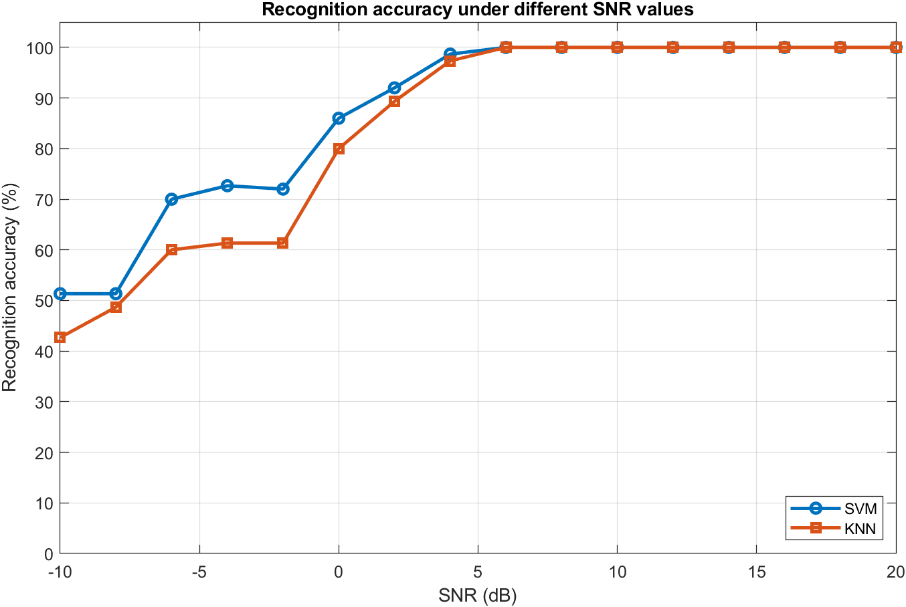
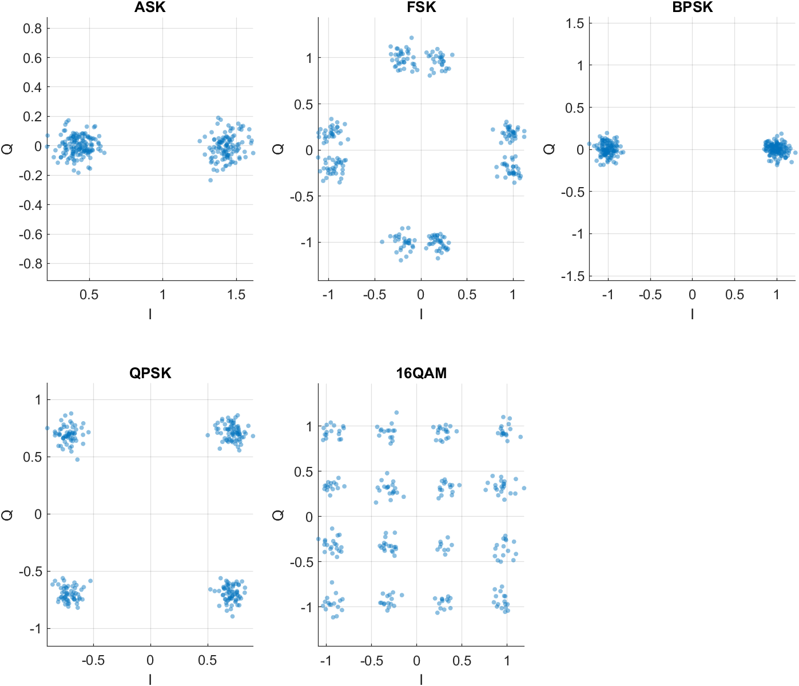
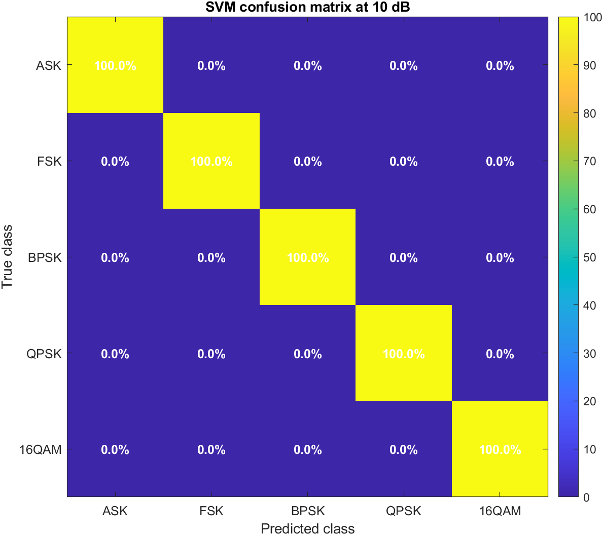

# Digital Modulation Recognition — MATLAB Simulation

[English](#english) | [中文](#中文)

This is a complete digital-communications modulation-recognition simulation project. MATLAB generates five modulation types — ASK, FSK, BPSK, QPSK, and 16QAM — adds AWGN at different SNR values, extracts amplitude, phase, frequency, and higher-order-cumulant features, and uses RBF-SVM and KNN to identify the modulation type.

## Features

- Generates ASK, FSK, BPSK, QPSK, and 16QAM signals
- Adds additive white Gaussian noise
- Plots time-domain waveforms, spectra, and constellations
- Extracts amplitude mean and variance, phase and frequency changes, and higher-order cumulants
- Uses RBF-SVM as the main classifier
- Uses KNN as the comparison classifier
- Reports recognition accuracy from -10:2:20 dB SNR
- Produces accuracy curves, confusion matrices, feature data, and a Chinese course paper

## Run the Simulation

Open MATLAB, set the current directory to the project root, then run:

~~~matlab
run_modulation_recognition
~~~

The complete source is:

~~~text
src/run_modulation_recognition.m
~~~

Results are saved to:

~~~text
results/
~~~

## Project Layout

~~~text
.
├─ README.md
├─ README_先看我.md
├─ run_modulation_recognition.m
├─ src/
│  └─ run_modulation_recognition.m
├─ docs/
│  ├─ 项目说明.md
│  ├─ 运行说明.md
│  ├─ 参数选择说明.md
│  ├─ 调制识别仿真小论文.md
│  ├─ 调制识别仿真小论文.docx
│  └─ 调制识别仿真小论文.pdf
└─ results/
   ├─ accuracy_by_snr.csv
   ├─ features_dataset.csv
   ├─ accuracy_vs_snr.png
   ├─ time_waveforms.png
   ├─ spectra.png
   ├─ constellations.png
   ├─ confusion_svm_10dB.png
   ├─ confusion_knn_10dB.png
   └─ simulation_models_and_results.mat
~~~

## Main Parameters

| Parameter | Value |
|---|---|
| Modulation types | ASK, FSK, BPSK, QPSK, 16QAM |
| SNR range | -10:2:20 dB |
| Samples per symbol | 8 |
| Symbols per frame | 256 |
| Main classifier | RBF-SVM |
| Comparison classifier | KNN, k = 5 |

## Simulation Results

SVM recognition accuracy approaches 100% after 4 dB and reaches 100% after 6 dB. KNN also performs well at high SNR, but is generally less stable than SVM at low SNR.

## Documentation

Course-project notes and paper material are in docs/:

- [Project description](docs/项目说明.md)
- [Run guide](docs/运行说明.md)
- [Parameter-selection guide](docs/参数选择说明.md)
- [Modulation-recognition simulation paper PDF](docs/调制识别仿真小论文.pdf)

# 数字调制识别 MATLAB 仿真工程

[English](#english) | [中文](#中文)

本项目是一个完整的数字通信调制识别仿真工程，使用 MATLAB 生成 ASK、FSK、BPSK、QPSK、16QAM 五类调制信号，在不同信噪比下加入 AWGN 噪声，提取幅度、相位、频率和高阶累积量特征，并使用 RBF-SVM 与 KNN 完成调制类型识别。

## 项目功能

- 生成 ASK、FSK、BPSK、QPSK、16QAM 五类数字调制信号
- 加入 AWGN 高斯白噪声
- 绘制时域波形、频谱图、星座图
- 提取幅度均值、幅度方差、相位变化、频率变化、高阶累积量等特征
- 使用 RBF-SVM 作为主分类器
- 使用 KNN 作为对照分类器
- 统计 -10:2:20 dB 不同 SNR 下的识别准确率
- 输出准确率曲线、混淆矩阵、特征数据和中文小论文

## 快速运行

打开 MATLAB，将当前目录切换到本工程根目录，然后运行：

~~~matlab
run_modulation_recognition
~~~

完整源代码位于：

~~~text
src/run_modulation_recognition.m
~~~

运行结果会保存到：

~~~text
results/
~~~

## 项目结构

~~~text
.
├─ README.md
├─ README_先看我.md
├─ run_modulation_recognition.m
├─ src/
│  └─ run_modulation_recognition.m
├─ docs/
│  ├─ 项目说明.md
│  ├─ 运行说明.md
│  ├─ 参数选择说明.md
│  ├─ 调制识别仿真小论文.md
│  ├─ 调制识别仿真小论文.docx
│  └─ 调制识别仿真小论文.pdf
└─ results/
   ├─ accuracy_by_snr.csv
   ├─ features_dataset.csv
   ├─ accuracy_vs_snr.png
   ├─ time_waveforms.png
   ├─ spectra.png
   ├─ constellations.png
   ├─ confusion_svm_10dB.png
   ├─ confusion_knn_10dB.png
   └─ simulation_models_and_results.mat
~~~

## 主要参数

| 参数 | 取值 |
|---|---|
| 调制类型 | ASK、FSK、BPSK、QPSK、16QAM |
| SNR 范围 | -10:2:20 dB |
| 每符号采样点数 | 8 |
| 每帧符号数 | 256 |
| 主分类器 | RBF-SVM |
| 对照分类器 | KNN，k = 5 |

## 仿真结果

SVM 在 4 dB 后准确率接近 100%，在 6 dB 后达到 100%。KNN 作为对照组，在高 SNR 下也能取得较好效果，但低 SNR 区间整体不如 SVM 稳定。

## 文档

课程设计说明和论文材料位于 docs/：

- [项目说明](docs/项目说明.md)
- [运行说明](docs/运行说明.md)
- [参数选择说明](docs/参数选择说明.md)
- [调制识别仿真小论文 PDF](docs/调制识别仿真小论文.pdf)
